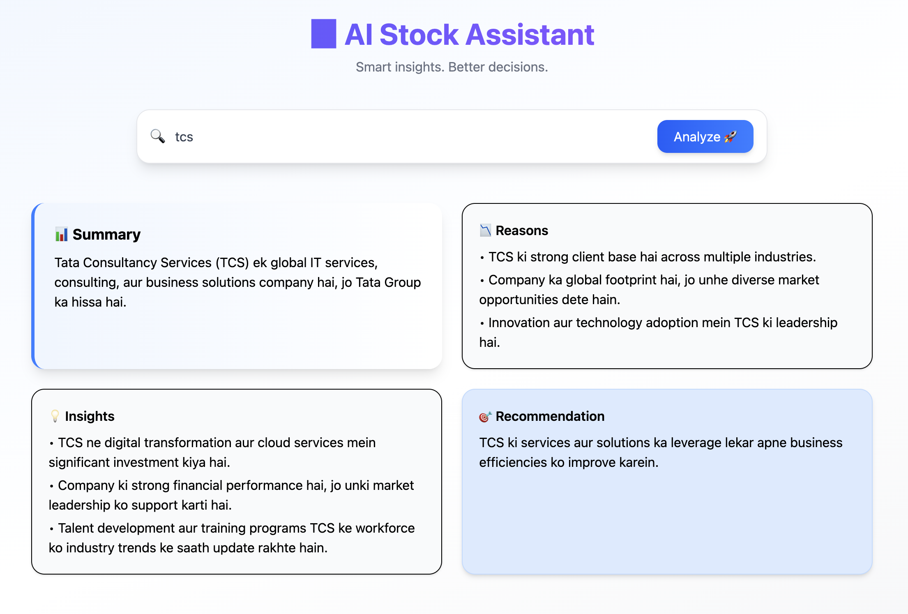

# 🚀 AI Stock Assistant

An intelligent stock analysis web application that combines **LLM (AI reasoning)** with **real-time financial data** to deliver structured, actionable insights for Indian stocks.

---



## 🌐 **Live Demo:** https://ai-stock-assistant-sigma.vercel.app/

## 🧠 Overview

AI Stock Assistant is not just a chatbot — it's a mini AI agent system that:

- Understands user queries (Hinglish / English)
- Decides whether real-time data is required
- Fetches data from multiple sources (Yahoo Finance, Web Search)
- Generates structured insights using AI

---

## ✨ Features

### 🔍 Smart Query Understanding

- Detects stock name
- Extracts intent (price, trend, prediction, news)
- Converts queries into optimized search format

---

### ⚡ Decision Engine

- Determines:
  - Whether real-time data is needed
  - Type of query: general or news

---

### 📊 Real-Time Data Integration

- **Yahoo Finance**
  - Current Price
  - Historical Trends

- **Serper (Google Search API)**
  - Latest news
  - Market reasons

---

### 🤖 AI-Powered Insights

Structured JSON output:

- Summary
- Reasons
- Insights
- Recommendation
- Disclaimer

---

### 🌐 Multilingual Support

- Hinglish
- Hindi
- English

Responds in the **same language as user input**

---

### ⚠️ Disclaimer

> This is general information, not financial advice. Please do your own research before investing.

---

## 🏗️ Architecture

## Tech Stack

### Frontend

- React + Vite
- Tailwind CSS

### Backend

- FastAPI
- OpenAI API
- yfinance
- Serper API

## Project Structure

```bash
ai-stock-app/
├── src/                  # React frontend
├── backend/
│   ├── main.py           # FastAPI app + AI pipeline
│   ├── requirements.txt  # Python deps
│   ├── pyproject.toml
│   └── .env              # API keys (local only)
├── package.json
└── README.md
How It Works
User asks a stock question
Backend decision engine classifies:
realtime needed or not
query type (general/news)
intent (price/trend/analysis)
If needed, app fetches:
stock data from Yahoo Finance
latest web snippets from Serper
LLM generates final structured JSON response
Frontend renders summary, reasons, insights, recommendation
API Response Format
{
  "summary": "string",
  "reasons": ["string"],
  "insights": ["string"],
  "recommendation": "string"
}
Local Setup
1) Clone & Install Frontend
git clone <your-repo-url>
cd ai-stock-app
npm install
2) Setup Backend
cd backend
python -m venv .venv
source .venv/bin/activate      # macOS/Linux
pip install -r requirements.txt
Create backend/.env:

OPENAI_API_KEY=your_openai_api_key
SERPER_API_KEY=your_serper_api_key
3) Run Backend
From backend/:

uvicorn main:app --reload --port 8001
4) Run Frontend
From project root:

npm run dev
Open the local URL shown by Vite (usually http://localhost:5173).

API Endpoint
POST /summarize
Body:
{
  "query": "TCS ka trend kaisa hai?"
}
Example Queries
TCS ka current price kya hai?
Infosys next 3 months ke liye kaisa lag raha hai?
Why is Reliance rising today?
HDFC long term ke liye sahi hai kya?
Disclaimer
This project is for informational/educational purposes only and is not financial advice. Always do your own research before making investment decisions.

Future Improvements
Add ticker-symbol mapping for better stock detection
Add caching/rate-limit handling for APIs
Add charts for historical trend visualization
Add unit/integration tests
Add authentication + per-user history
```
